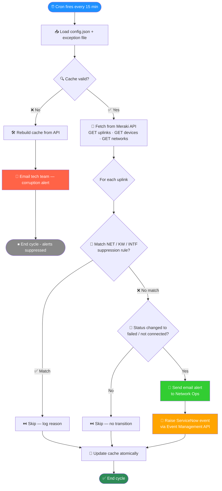
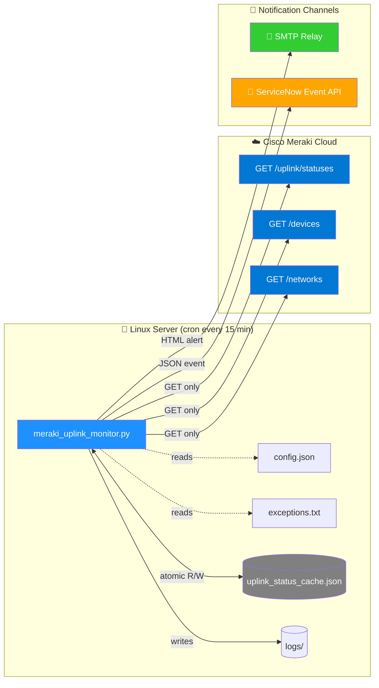

<div align="center">

# 🛡️ Meraki Uplink Monitor

### *Automated WAN failure detection for Cisco Meraki MX appliances*

##### *Built for production · Read-only API · Self-healing cache · Smart suppression*

[](https://www.python.org/downloads/)
[](LICENSE)
[](#-read-only-api-guarantee)
[](#-servicenow-event-example)
[](#-getting-started)
[]()

</div>

---

## ⚡ At a Glance

| | |
|---|---|
| 🔍 **Watches** | All WAN uplinks on Meraki MX appliances |
| 📡 **API access** | Read-only — `GET` only, never modifies config |
| 📧 **Notifies** | Email (HTML) + ServiceNow Event Management |
| 🎯 **Suppresses** | Networks, keywords, or specific interfaces |
| 🔄 **Runs** | Every 15 minutes via cron |
| 💾 **Self-heals** | Detects & repairs cache corruption automatically |
| 🚦 **Smart** | Alerts only on status *change* — no spam |

---

## ✨ Features

- 🔒 **Read-only Meraki API** — only `GET` is ever issued; the script *cannot* modify Meraki configuration
- 🔁 **Status-change alerting** — alerts only on `active → failed/not connected` transitions, no repeat noise
- 🎚 **Three-tier suppression** — exact network match, keyword match, or specific interface match
- 📨 **Dual notification** — HTML email to operations team + ServiceNow event in parallel
- 🔧 **Self-healing cache** — corruption detected, repaired, and reported automatically; alerts suppressed during recovery cycle to prevent false-alarm floods
- ⚛️ **Atomic writes** — temp file + rename ensures cache is never corrupted by partial writes
- 🚦 **Rate-limit aware** — exponential backoff on HTTP 429, respects `Retry-After` header
- 📚 **Log rotation** — keeps the most recent N log files, deletes the oldest

---

## 🗺️ How It Works



---

## 📧 Example Email Alert

> When a WAN link goes down, recipients receive a clean HTML email like this:

<table>
  <tr>
    <td><b>From:</b></td><td>Meraki Uplink Alerts &lt;noreply@example.com&gt;</td>
  </tr>
  <tr>
    <td><b>To:</b></td><td>network-ops@example.com, noc@example.com</td>
  </tr>
  <tr>
    <td><b>Cc:</b></td><td>team-lead@example.com</td>
  </tr>
  <tr>
    <td><b>Subject:</b></td><td><code>Meraki Uplink Failure Alert - Region-A - Site-1 - SITE1-FW01 - wan2 - Failed</code></td>
  </tr>
</table>

---

<h2 align="left" style="color:#1E90FF;">⚠️ Meraki Uplink Alert</h2>

**Dear Team,**

The following uplink issue was detected:

| Network | Device | Serial | Interface | IP | Status | Previous | Notes |
|---------|--------|--------|-----------|-----|--------|----------|-------|
| Region-A - Site-1 | SITE1-FW01 | Q2YN-XXXX-XXXX | wan2 | 203.0.113.45 | 🔴 Failed | 🟢 Ready | WAN1 - 200MB Fiber WAN2 - 30MB FWA Backup |

*Best regards,*
*Meraki Monitoring System*

---

## 🎫 Example ServiceNow Event

> The same incident is automatically raised in ServiceNow Event Management:

```json
{
  "resolution_state": "New",
  "description": "Meraki Uplink Failure Alert - Region-A - Site-1 - SITE1-FW01 - wan2 - Failed",
  "source": "Meraki",
  "severity": "1",
  "resource": "SITE1-FW01",
  "node": "SITE1-FW01",
  "metric_name": "Meraki Uplink Failure Alert",
  "event_class": "Custom Meraki Event Management",
  "time_of_event": "2026-04-30 06:00:14",
  "additional_info": {
    "priority": 3,
    "assignment_group": "Network Operations",
    "category": "network",
    "subcategory": "WAN",
    "details": "Location Name: Region-A - Site-1\nHostname: SITE1-FW01\nMX Serial Number: Q2YN-XXXX-XXXX\nInterface: wan2\nIP Address: 203.0.113.45\nLink Status: Failed\nMX Note: WAN1 - 200MB Fiber WAN2 - 30MB FWA Backup"
  }
}
```

📋 **Resulting incident in ServiceNow:**

| Field | Value |
|---|---|
| 🎟 Number | `INC0012345` *(auto-generated)* |
| 🏢 Assignment Group | Network Operations |
| 🏷 Category / Subcategory | network / WAN |
| ⚡ Priority | 3 — Moderate |
| 📦 Source | Meraki |
| 🖥 Configuration Item | `SITE1-FW01` |

---

## 🎚 Suppression Engine

Three rule types — each line in `exceptions.txt` starts with a prefix:

| Prefix | Effect | Match | Example |
|---|---|---|---|
| 🌐 **`NET:`** | Suppresses entire network | Exact, case-sensitive | `NET: Region-A - Site-1` |
| 🔑 **`KW:`** | Suppresses any network whose name *contains* this keyword | Substring, case-sensitive | `KW: Not-Live` |
| 🔌 **`INTF:`** | Suppresses one interface on one device in one network | Exact on all 3 fields | `INTF: Region-A - Site-1 - SITE1-FW01 - wan2` |

> 💡 Comments after `#` are ignored by the parser — use them to record the change-ticket ID and reason. **This is mandatory** for audit:

```ini
# Suppress entire network
NET: Region-A - Lab Network    # CHG0012345 Lab — not customer-facing

# Suppress all networks containing this keyword
KW: Not-Live                   # SR0011001 All non-live networks excluded

# Suppress one specific interface
INTF: Region-A - Site-1 - SITE1-FW01 - wan2    # INC0012345 FWA backup circuit
```

---

## 📜 Example Log Output

> Each run writes a timestamped log file. Here's what a healthy cycle looks like:

```log
2026-04-30 06:00:01 - INFO: Meraki uplink monitoring script started
2026-04-30 06:00:01 - INFO: Starting uplink monitoring cycle
2026-04-30 06:00:01 - INFO: Log folder stats - Files: 432, Size: 8.21 MB, Oldest: 2026-01-15 10:00:03
2026-04-30 06:00:01 - INFO: Starting log cleanup process
2026-04-30 06:00:01 - DEBUG: Log file count (432) within limit (700)
2026-04-30 06:00:01 - INFO: ServiceNow configuration validated successfully
2026-04-30 06:00:01 - DEBUG: Checking cache integrity before API calls
2026-04-30 06:00:01 - INFO: Cache loaded and validated successfully
2026-04-30 06:00:01 - INFO: Cache is healthy - proceeding with normal alert processing
2026-04-30 06:00:01 - INFO: Loaded exceptions — NET: 4, KW: 3, INTF: 2
2026-04-30 06:00:02 - INFO: Fetching appliance uplink status from Meraki API
2026-04-30 06:00:03 - INFO: Retrieved 482 appliance uplink statuses
2026-04-30 06:00:03 - INFO: Fetching device details from Meraki API
2026-04-30 06:00:05 - INFO: Retrieved 482 devices from page. Total so far: 482
2026-04-30 06:00:05 - INFO: Fetching network details from Meraki API
2026-04-30 06:00:06 - INFO: Retrieved 178 network details
2026-04-30 06:00:06 - DEBUG: Processing 482 devices for alerts
2026-04-30 06:00:06 - INFO: Skipping network (NET exact match): Region-A - Lab Network
2026-04-30 06:00:06 - INFO: Skipping network (KW match): Not-Live-Region-B (keyword: Not-Live)
2026-04-30 06:00:07 - DEBUG: Q2YN-XXXX-XXXX wan2 - Current: failed, Previous: ready
2026-04-30 06:00:07 - ALERT: Processing uplink alert for SITE1-FW01 wan2 - ready -> failed
2026-04-30 06:00:07 - INFO: Preparing to send uplink alert: Meraki Uplink Failure Alert - Region-A - Site-1 - SITE1-FW01 - wan2 - Failed
2026-04-30 06:00:08 - SUCCESS: Uplink alert sent successfully to operations team
2026-04-30 06:00:08 - SUCCESS: Uplink email alert sent for SITE1-FW01 wan2
2026-04-30 06:00:08 - INFO: Sending ServiceNow event for SITE1-FW01 wan2
2026-04-30 06:00:09 - DEBUG: ServiceNow response status: 200
2026-04-30 06:00:09 - SUCCESS: ServiceNow event created successfully for SITE1-FW01 wan2
2026-04-30 06:00:09 - SUMMARY: Uplink alert #1 processed for SITE1-FW01 wan2
2026-04-30 06:00:10 - INFO: Structured cache saved - 964 uplinks, 1 failed, 963 active
2026-04-30 06:00:10 - INFO: Cache saved successfully with atomic write
2026-04-30 06:00:10 - INFO: Monitoring cycle completed - 1 uplink alerts sent to operations team
2026-04-30 06:00:10 - INFO: Script completed successfully
```

🎨 **Log severity colours** *(when viewed in compatible viewers)*:

| Level | Use |
|---|---|
| 🟢 `SUCCESS` | Email or ServiceNow event sent |
| 🔵 `INFO` | Normal operation |
| ⚪ `DEBUG` | Detailed trace |
| 🟡 `WARNING` | Non-critical issue |
| 🟠 `ALERT` | Uplink failure being processed |
| 🔴 `ERROR` | Operation failed but script continued |
| 🟣 `CRITICAL` | Script-level failure |

---

## 🧱 Architecture



---

## 🚀 Getting Started

### 1️⃣ Clone & install

```bash
git clone https://github.com/<your-username>/meraki-uplink-monitor.git
cd meraki-uplink-monitor
pip install requests
```

### 2️⃣ Configure

```bash
cp config.example.json config.json
```

Edit `config.json` and fill in:
- 🔑 Your Meraki API key and organization ID
- 📨 SMTP server, sender, and recipient lists
- 🎫 ServiceNow Event Management endpoint and credentials
- 📁 Absolute paths to the cache file, log folder, and exception file

### 3️⃣ Create the suppression file

```bash
cp examples/exceptions.example.txt /opt/meraki-uplink-monitor/inputs/exceptions.txt
```

Edit per your environment — see [📘 SOP-Exception-Management.md](docs/SOP-Exception-Management.md).

### 4️⃣ First run

```bash
python3 meraki_uplink_monitor.py
```

> 💡 **First run builds the cache and sends no alerts.** From the second run onward, status transitions trigger emails and ServiceNow events.

### 5️⃣ Schedule via cron

```cron
*/15 * * * * /usr/bin/python3 /opt/meraki-uplink-monitor/meraki_uplink_monitor.py
```

---

## ⚙️ Configuration Reference

| Section | Key | Description |
|---|---|---|
| `meraki` | `api_key`, `org_id` | 🔑 Dashboard API credentials |
| `paths` | `cache_file`, `log_folder`, `exceptions_file` | 📁 Absolute paths |
| `logging` | `max_log_files` | 📚 Log rotation limit |
| `smtp` | `server`, `port`, `sender`, `display_name` | 📧 Email server details |
| `email_uplink_alerts` | `recipients`, `cc`, `bcc` | 👥 Operations recipients |
| `email_cache_alerts` | `recipients`, `cc`, `bcc` | 🛠 Tech-team (cache corruption only) |
| `servicenow` | `endpoint`, `username`, `password` | 🎫 Event Management API |

---

## 📁 Repository Layout

```
meraki-uplink-monitor/
├── 🐍 meraki_uplink_monitor.py      ← Main script
├── ⚙️  config.example.json           ← Config template (copy to config.json)
├── 📂 examples/
│   └── 📝 exceptions.example.txt     ← Sample suppression rules
├── 📂 docs/
│   ├── 📘 Runbook.md                 ← Operational runbook
│   └── 📗 SOP-Exception-Management.md  ← How to add/remove suppression rules
├── 🚫 .gitignore
├── 📜 LICENSE
└── 📖 README.md
```

---

## 🔒 Read-Only API Guarantee

Only three Meraki endpoints are ever called, and **all** use `GET`:

```
GET /organizations/{orgId}/appliance/uplink/statuses
GET /organizations/{orgId}/devices
GET /organizations/{orgId}/networks
```

✅ Verifiable in one command:

```bash
grep -E "requests\.(post|put|patch|delete)|session\.(post|put|patch|delete)" meraki_uplink_monitor.py
```

This returns *only* the ServiceNow event POST — never a Meraki call. The rule is enforced by code review and is part of the project ruleset.

---

## 🛡️ Security Notes

| Risk | Mitigation |
|---|---|
| API keys in `config.json` | File is gitignored; deploy with `chmod 600` |
| ServiceNow password | Same — never committed; rotate periodically |
| Race conditions on cache | Atomic temp-file + rename pattern |
| Partial writes | Backup created before each save |
| Alert storm during cache rebuild | Alerts suppressed for one cycle when cache is rebuilt |

---

## 🧪 Testing in Production Safely

To verify alerts end-to-end without spamming the team:

1. Temporarily redirect `email_uplink_alerts.recipients` in `config.json` to your own email
2. Pick a healthy uplink and edit its status from `active` to `not connected` in the cache file
3. Run the script manually: `python3 meraki_uplink_monitor.py`
4. Verify: email arrives + ServiceNow event appears + log shows `SUCCESS` lines
5. Restore the production recipient list and remove your manual cache edit

---

## 📚 Documentation

| Document | Purpose |
|---|---|
| 📘 [Runbook](docs/Runbook.md) | Operational reference for non-coding network engineers |
| 📗 [SOP — Exception Management](docs/SOP-Exception-Management.md) | Step-by-step guide to adding/removing suppression rules |

---

## 🤝 Contributing

Contributions welcome! Please:

1. Open an issue first to discuss any major change
2. Keep the **read-only Meraki API rule** intact — no `POST/PUT/PATCH/DELETE` to `api.meraki.com`, ever
3. Update the runbook and SOP if your change affects operational behaviour
4. Add log lines for any new branch in alert logic

---

## 📜 License

MIT — see [LICENSE](LICENSE).

---

<div align="center">

### *Built with ❤️ for Network Operations teams who'd rather sleep at night.*

⭐ **Star this repo** if you find it useful · 🐛 **Open an issue** if something's broken · 🔧 **PR welcome**

</div>

---

> ⚠️ *Cisco Meraki and ServiceNow are trademarks of their respective owners. This is an independent open-source project — not affiliated with either company.*
